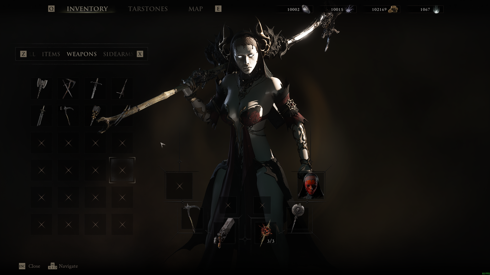
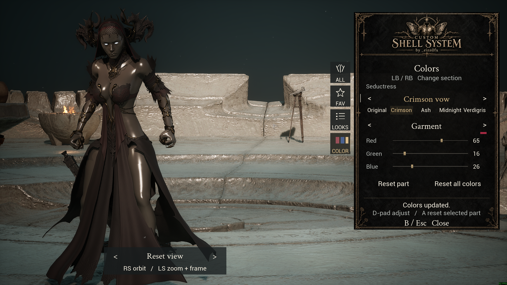
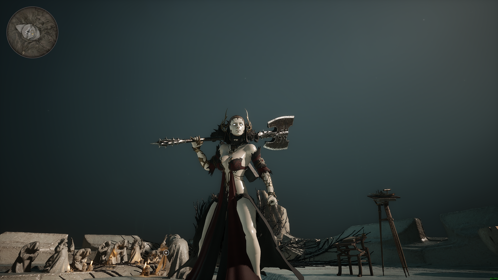
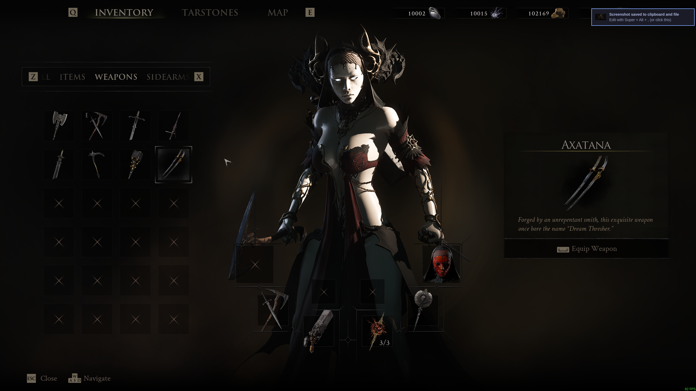
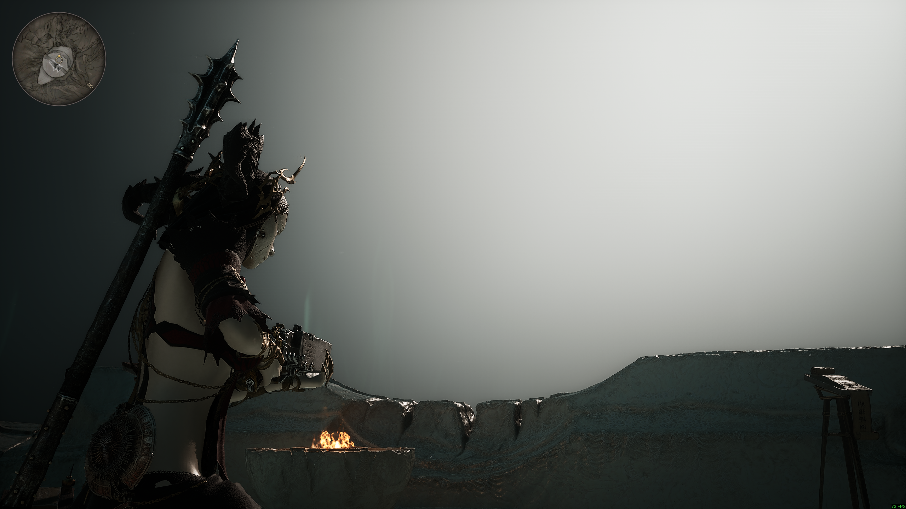
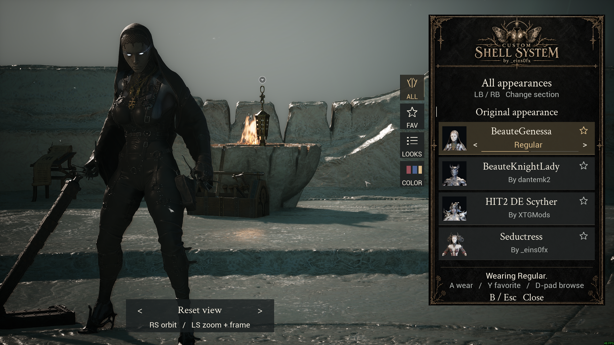
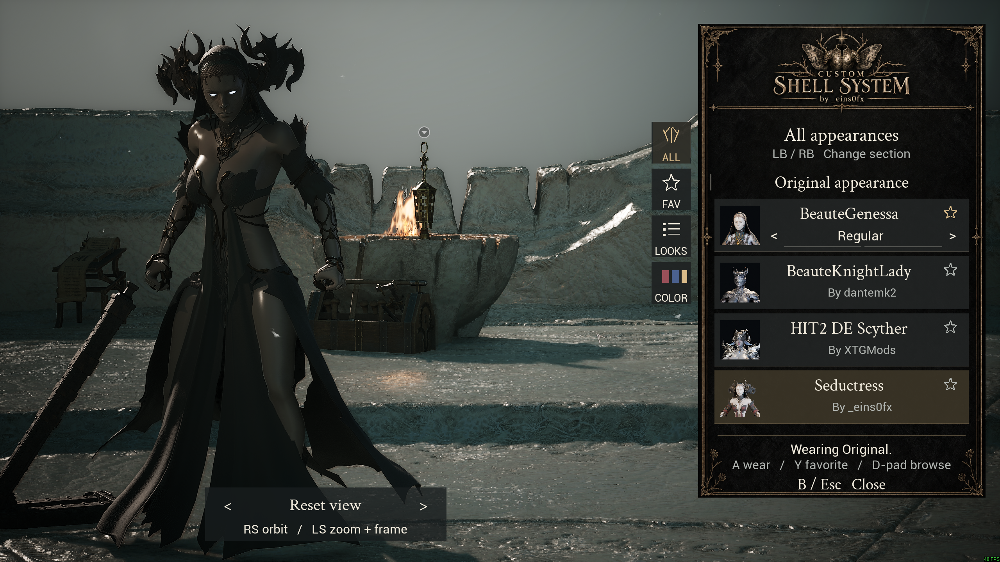
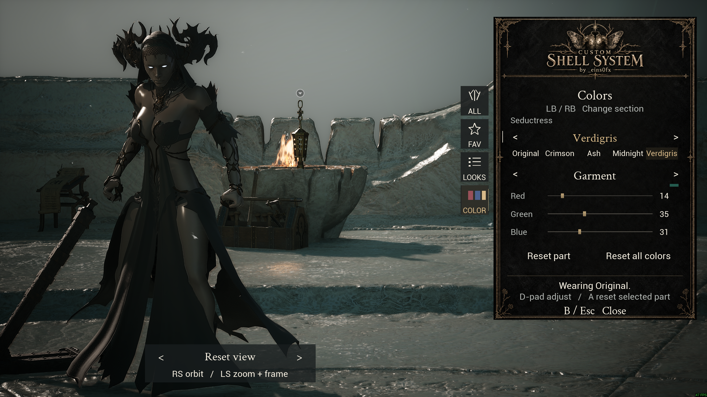
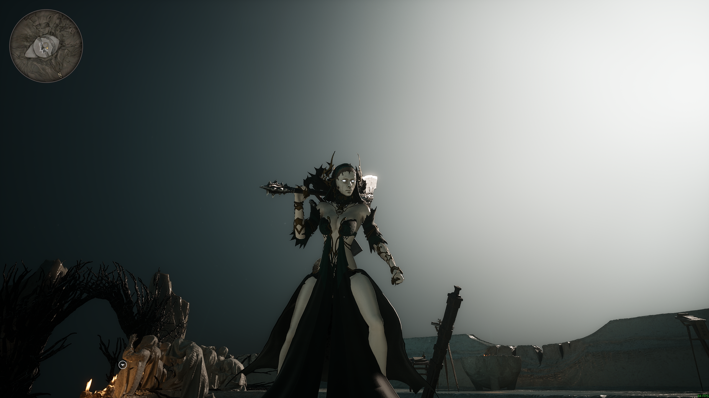

# CSS: Custom Shell System

Current runtime version: **0.1.2**. See [runtime releases](docs/releases.md) for the
clean ZIP, installation layout and first-run verification.

A native C++23 wardrobe for Mortal Shell II, inspired by [Custom Nanosuit System](https://www.nexusmods.com/stellarblade/mods/1496?tab=description). Browse compatible outfits with variants, per-part colors, favorites, three saved-look slots, an animated character preview and controller navigation.

**[Download CSS v0.1.2](https://github.com/ngodn/CustomShellSystem/releases/tag/v0.1.2)**.
Requires [UE4SS for MS2](https://www.nexusmods.com/mortalshell2/mods/45?tab=files)
and separate CSS outfit packages. The runtime ZIP does not include the outfits
shown below. Seductress is a development example.

Selecting an appearance preserves your current gameplay shell and abilities. The installed outfits use the game's human skeleton, which CSS checks before every mesh replacement. Weapons, seals and shells do **not** need to be unlocked for these cosmetic selections. CSS does not edit the game save or unlock progression.

## See it in action

[](https://raw.githubusercontent.com/ngodn/CustomShellSystem/main/docs/media/v0.1.1/css-wardrobe-demo.mp4)

**[Watch the 63-second wardrobe demo (MP4)](https://raw.githubusercontent.com/ngodn/CustomShellSystem/main/docs/media/v0.1.1/css-wardrobe-demo.mp4)**.
Click the image or link to open the recording. The Seductress development
outfit is shown in the game inventory above; outfit packages are separate
downloads.



Preset palettes and custom colors on the Seductress development outfit.
Editable parts depend on the installed package. Wardrobe lighting can differ
from gameplay; this remains a known issue in 0.1.2.

<details>
<summary>More screenshots</summary>



Front view of Seductress during gameplay.



The same development outfit in the inventory with Axatana selected.



A closer look at the Seductress development outfit in the game world.



The appearance browser with BeauteGenessa by dantemk2.



Switch appearances while keeping your gameplay shell.



Adjust a selected part or reset its colors.



The Seductress development outfit in the game world.

</details>

See [media credits and Nexus BBCode](docs/media/README.md) for the original
mod links and reusable image/video links.

## Controls

| Action | Controller | Keyboard / mouse |
| --- | --- | --- |
| Open / close CSS | View / Back + Y | N |
| Close | B | Esc or Close |
| Browse appearances | D-pad up / down, list follows selection | Mouse wheel, scrollbar or click a row |
| Change variant | D-pad left / right | Variant arrows |
| Wear selected appearance | A | Click the appearance |
| Favorite | Y | Star |
| Change category | LB / RB | All / Fav / Looks / Color rail |
| Save or replace a look | X in Looks | Save / Replace |
| Open saved looks | X elsewhere | Looks rail |
| Adjust colors | D-pad rows and left / right | RGB sliders and palette buttons |
| Reset selected color part | A on a color channel | Reset part |
| Orbit character | Right stick | Right mouse drag |
| Zoom / horizontal framing | Left stick vertical / horizontal | W / S to zoom |
| Raise / lower framing | RT / LT | E / Q |
| Reset view | Right-stick click | Reset view |

Right-stick vertical movement is inverted by default; horizontal movement is normal. Wardrobe changes keep the existing camera. They recenter a moved view, but leave already-default framing untouched.

CSS pauses gameplay while open. A separate, collision-free visual copy plays a full-body idle using real elapsed time, with animation notifies suppressed. The real player's animation instance remains in place. Closing CSS removes the copy, restores visibility and input, and releases only the pause CSS acquired. This is a wardrobe idle preview, not an animation-library editor.

See the [color guide](docs/colors.md) for Original restoration, custom skin/face/eye controls, saved colors and authoring color-enabled outfit packages.

## State and development

The installed mod lives in:

```text
MortalShell2/Binaries/Win64/ue4ss/Mods/CustomShellSystem/
  state/state.json       CSS settings, selections, favorites and saved looks
  state/state.json.bak   Previous valid state
  catalog/              Optional developer catalogs (normal outfits embed theirs)
  cache/packages/       Rebuildable package artwork and color-mask cache
  assets/               Original CSS interface artwork
  cores/                Versioned native core DLLs
  core.json             Requested core version
  runtime/              Live acknowledgements and diagnostics
```

State writes use temporary files, flushes, replacement and backup recovery. Settings include `invert_orbit_x`, `invert_orbit_y` and `auto_apply`. Edit settings with the game closed, or use the native development tab while running. Core reload reads saved settings again.

From this project directory:

```bash
python3 tools/css.py build
python3 tools/css.py reload
python3 tools/css.py open
python3 tools/css.py inspect
python3 tools/css.py close
```

`reload` builds and stages only the reloadable core, refreshes PNGs and catalogs, and waits for the exact version acknowledgement from the running game. It closes an active wardrobe cleanly. Loader ABI or mounted IoStore asset changes still require a restart; native core development does not.

This build targets UE5.6 and the exact installed UE4SS `d7e7826d` GameShippingWin64 ABI. It uses clang-cl 22.1.8, the xwin Windows SDK, C++23 and the dynamic release CRT. The Python tools target Python 3.14. See [SDK notes](docs/ue4ss-sdk.md) before changing toolchain or UE4SS versions, and [repository conventions](docs/repository.md) for tracked files, dependency patches and local checks.

Initial native runtime installation uses `python3 tools/css.py install` with the game closed and a completed build. Outfit installation is separate, using `tools/css_package.py`. The current machine has eight self-contained outfit packages installed. The old merged Beaute prototype and its loose catalog are backed up under `backups/packages-1789299191603415319`. See the package guide below for conversion and updates.

## Verification and limits

The live checks passed for all three appearances, material restoration, animated preview bones during frozen game time, conditional camera recentering, close cleanup and core reload without restarting. The user confirmed the animation and camera now look right. Host validation includes 34 behavioral checks and 22 Python tests. Evidence and remaining checks are in [STATUS.md](docs/STATUS.md).

Death, travel, save reload, other gameplay shells, extended combat and performance profiling still need a broader regression pass. Transient material overrides are refused when their exact restoration cannot be guaranteed. Preview cloth now ticks during pause and passed the three-variant live lifecycle check. Other procedural physics and mod-specific animation behavior still need individual validation. Full CNS feature parity, independent cosmetic slots, material editing and an animation library remain unfinished.

CSS code and interface artwork are original. CNS is the feature and interaction reference; its scripts, blueprints and artwork are not included. The converted Beaute assets are for this local installation. Both Beaute mods are credited to dantemk2, confirmed by the user. HIT2 DE Scyther is credited to XTGMods.

## Self-contained outfit packages

Use `tools/css_convert.py` to convert `.pak` / `.utoc` / `.ucas` inputs with author metadata and an embedded thumbnail. Default naming is `CSS_${NAME}_${AUTHORorMODDER}_P`. HIT2 and both Beaute packages are built under `dist/`. See [the package guide](docs/css-packages.md) for author artwork, grouped variants, material recipes, verification and migration.
