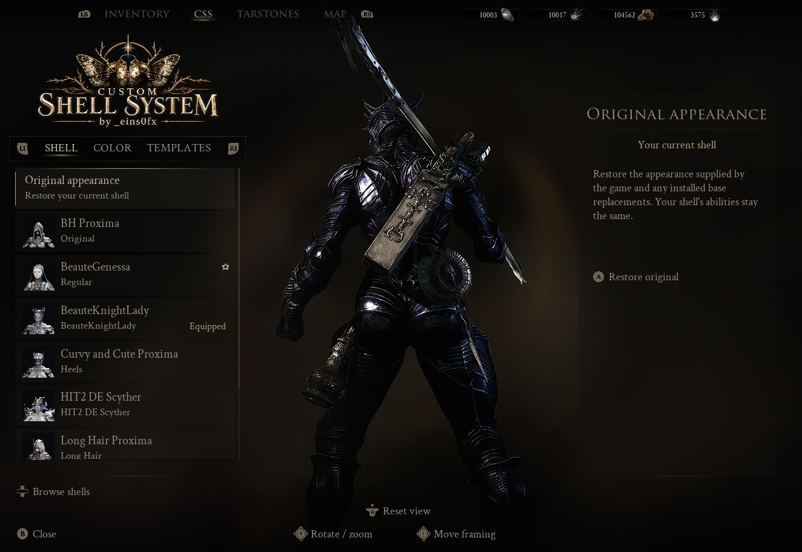
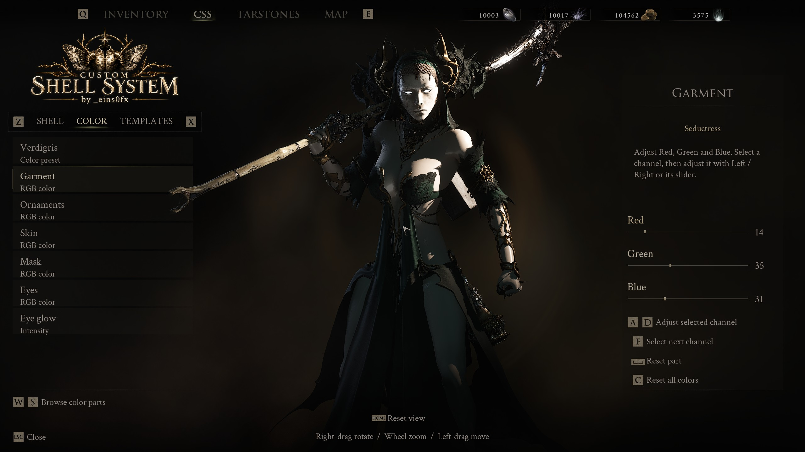
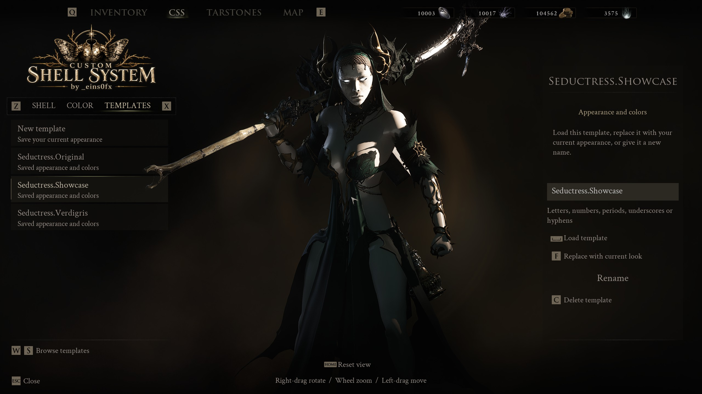
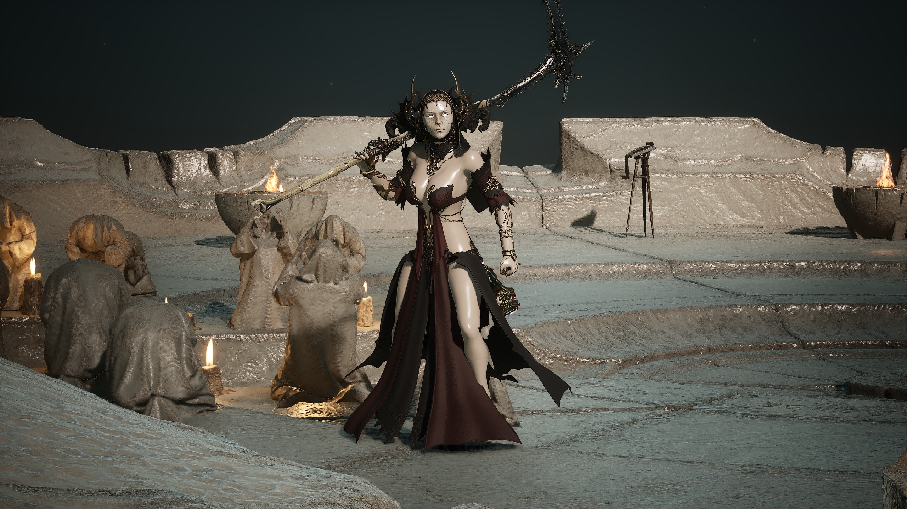

# Custom Shell System (CSS) for Mortal Shell II

A native C++ wardrobe mod by **_eins0fx**. Change your shell's appearance without changing its abilities, with outfit variants, per-part colors, favorites, saved looks and an animated preview.

I built CSS around a single wardrobe for compatible outfit packages, inspired by [Custom Nanosuit System](https://www.nexusmods.com/stellarblade/mods/1496?tab=description). Mouse, keyboard and controller controls are supported.

**[Download CSS 0.2.0](https://github.com/ngodn/CustomShellSystem/releases/tag/v0.2.0)** · [Release notes](packaging/release-notes.md) · [Converter](tools/css_convert.py)



CSS lives in **Inventory → CSS**, with Shell, Color and Templates sections, the game's character preview and native menu controls. Version 0.2.0 replaces the standalone N wardrobe. Existing CSS outfit packages and saved choices remain supported.

## Install

1. Close Mortal Shell II and install [UE4SS for MS2](https://www.nexusmods.com/mortalshell2/mods/45?tab=files). CSS targets `v3.0.1-1028-gd7e7826d`, included in the verified main-file bundle version 1.1.
2. Extract `CustomShellSystem` from the runtime ZIP into `MortalShell2/Binaries/Win64/ue4ss/Mods/`.
3. Install CSS outfit packages separately into `MortalShell2/Content/Paks/~mods/`, following each package's instructions.
4. Launch the game, load a save and open **Inventory** (default **I**) and select **CSS**. Choose an outfit, then Wear.

The runtime ZIP includes one loader DLL, one core DLL and the required interface artwork. It does not include UE4SS, outfit packages or personal state. Keep `CustomShellSystem/state/` when updating to retain your choices. Restart the game after adding or replacing outfit containers.

## Features

- Scroll through installed outfits and their mesh variants.
- Use preset palettes or adjust author-configured parts with RGB sliders.
- Keep favorites and save named appearance templates.
- Orbit, zoom and frame an animated preview while gameplay is paused.
- Restore your original appearance or reset colors.

CSS stores its settings separately from the game save. It does not unlock equipment or change your gameplay shell. Compatible cosmetic outfits do not require unlocking all shells, weapons or seals.

## Screenshots and video

[](https://raw.githubusercontent.com/ngodn/CustomShellSystem/main/docs/media/v0.2.0/css-menu-demo-1080p60.mp4)

[Watch the CSS menu walkthrough, 1080p60](https://raw.githubusercontent.com/ngodn/CustomShellSystem/main/docs/media/v0.2.0/css-menu-demo-1080p60.mp4). Shows all eight installed outfits and nineteen mesh variants, then Seductress colors, templates and camera controls.



[](https://raw.githubusercontent.com/ngodn/CustomShellSystem/main/docs/media/v0.2.0/seductress-showcase-1080p60.mp4)

[Watch the Seductress showcase, 1080p60](https://raw.githubusercontent.com/ngodn/CustomShellSystem/main/docs/media/v0.2.0/seductress-showcase-1080p60.mp4). Multiple angles and palettes, recorded directly in the game.

See the [full 0.2.0 gallery and capture notes](docs/media/v0.2.0/README.md) and [media credits](docs/media/README.md). Outfit packages are separate downloads.

## Controls

Default game bindings are listed below. CSS follows the mapped menu keys and shows prompts beside each action.

| Action | Controller | Keyboard / mouse |
| --- | --- | --- |
| Open Inventory, then select CSS | Native Inventory binding, then LB / RB | I, then Q / E or click CSS |
| Shell / Color / Templates | LT / RT | Z / X or click the section |
| Browse the left list | D-pad up / down | W / S, scroll or click |
| Change variant or selected color value | D-pad left / right | A / D or arrows / slider |
| Wear, reset part or load template | A | Space or action button |
| Favorite, reset all colors or delete template | Y | C or action button |
| Next RGB channel or replace template | X | F or action button |
| Rotate | Right stick left / right | Right mouse drag over the character |
| Zoom | Right stick up / down | Mouse wheel over the character |
| Move framing | Left stick | Left mouse drag over the character |
| Reset view | Right-stick click | Home or Reset view |
| Close | B | Esc |

Actions depend on the selected section. Camera controls affect the menu preview, not the gameplay character. The game's Inventory owns the pause and transitions.

## For modders

Start with the [CSS modding guide](docs/modding/README.md). It covers asset requirements, mesh variants, per-part colors, project recipes and verified release ZIPs. The guide documents the 0.2.0 source and CSS.Package v1. Tools are available in the GitHub source; the player runtime ZIP contains only the files needed in UE4SS Mods. The framework is still under development.

For repeatable builds, use [css_project.py](tools/css_project.py) to create a project, check its inputs and build its outfit trio plus install ZIP. [Experimental Unreal authoring source](docs/modding/advanced-tools.md) is included separately, with its current limits. No native DLL build is needed to package an existing compatible outfit.

The converter handles cooked Mortal Shell II appearance mods. It accepts a directory or `.pak` / `.utoc` / `.ucas` inputs and creates a package with author metadata and a thumbnail. It does not fit another game's meshes to the Mortal Shell II skeleton.

Use Python 3.14, retoc, repak and your local Mortal Shell II files. From the repository directory:

```sh
python3 tools/css_convert.py '/path/to/original-mod' \
  --name 'My Outfit' --author 'YourName' --id yourname.myoutfit \
  --thumbnail '/path/to/thumbnail.png' \
  --game '/path/to/MortalShell2' \
  --retoc '/path/to/retoc' --repak '/path/to/repak' \
  --output './dist'
```

Provide a square PNG, preferably 512 x 512. The default output is `CSS_My_Outfit_YourName_P/` containing one matching `.pak/.utoc/.ucas` trio. Keep the package ID stable across updates. Check [tool setup and dependency versions](docs/repository.md) before building the tools.

Some source mods need material-slot mappings, missing-dependency repairs, skeleton checks or hand-authored color masks. Use `--variant-sources` for separate alternate packs and `--colors` for an outfit color recipe. Variant groups can each supply their own materials and colors. A successful conversion still needs in-game testing.

- [Package format and converter usage](docs/css-packages.md)
- [Combining variants and handling source-specific adjustments](docs/porting-variants.md)
- [Color recipes and masks](docs/colors.md)
- [Native build requirements](docs/ue4ss-sdk.md)
- [Build, install and live reload](docs/native-development.md)

The runtime is C++23, built with clang-cl and the pinned UE4SS SDK. The core supports live reload during development; installing a new loader or outfit containers requires a restart. [Runtime release packaging](docs/releases.md) documents clean builds and fresh-state checks.

## Compatibility and known issues

Regular mesh replacement mods do not automatically become CSS wardrobe entries. Base-game mesh or material replacers can affect CSS outfits that reference those assets. Editable parts depend on the outfit author.

CSS 0.2.0 uses the native Inventory preview and lighting. Existing CSS.Package v1 outfit ZIPs, including the Beaute, HIT2 and Seductress packages, do not need repacking. Replace the old CSS runtime ZIP when upgrading.

Cloth, secondary animation and clipping depend on the outfit. Long combat sessions, other gameplay shells, display/controller combinations and performance still need broader testing.

If you report a problem, include your CSS version, outfit, active gameplay shell and reproduction steps. A screenshot or short recording helps. [Implementation and test status](docs/STATUS.md) tracks the current checks and limits.

## Credits

- **_eins0fx**: CSS development, interface and packaging.
- [Custom Nanosuit System by DekitaRPG](https://www.nexusmods.com/stellarblade/mods/1496?tab=description): feature and interaction inspiration.
- UE4SS contributors and Framecore: UE4SS and its Mortal Shell II distribution.
- **dantemk2**: the BeauteGenessa and BeauteKnightLady outfit examples.
- **XTGMods**: HIT2 DE Scyther, shown in the demo.
- **Skirbie, dantemk2, Larian Studios and Volno's Lazy Tailor library**: source credits for my separate Seductress adaptation.

CSS does not bundle CNS scripts, blueprints or artwork. Outfit assets are separate from the runtime ZIP. See [media credits](docs/media/README.md) and [Nexus descriptions](docs/nexus/README.md).
