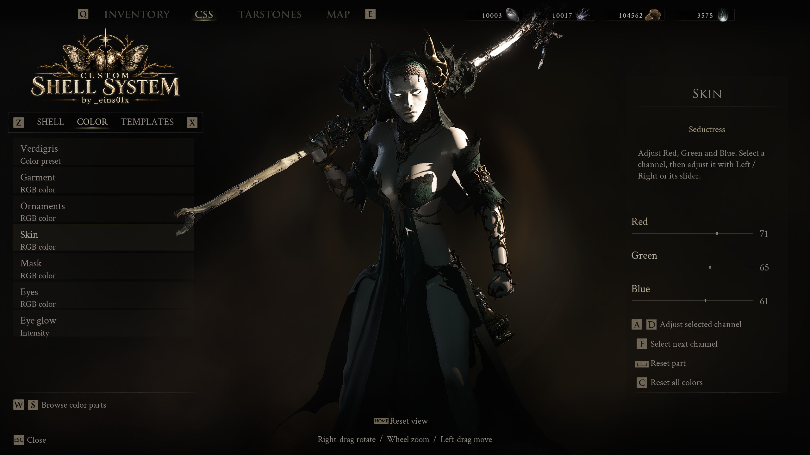
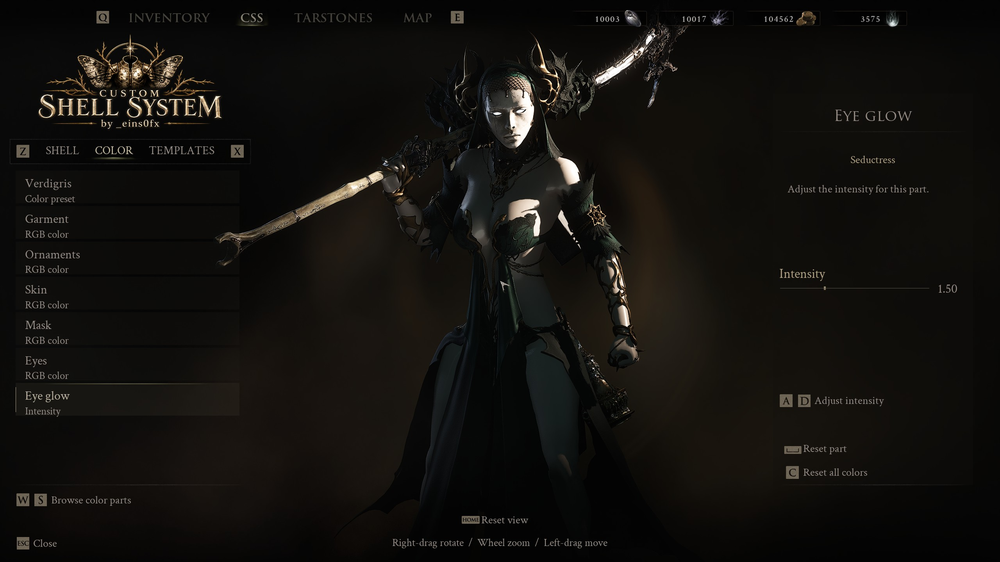
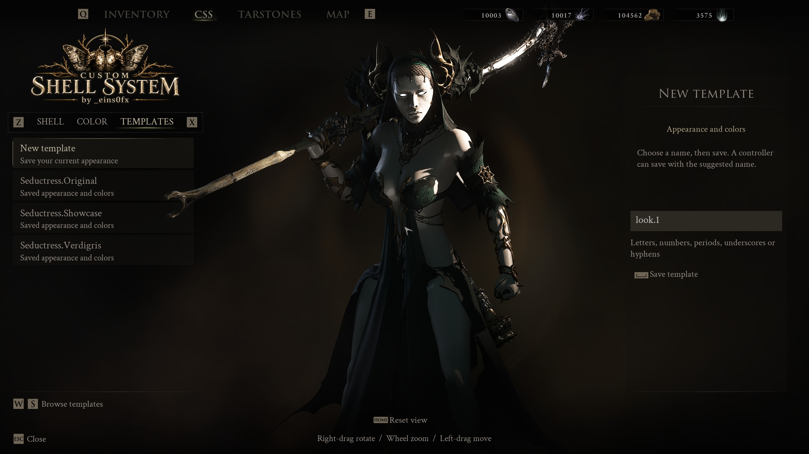
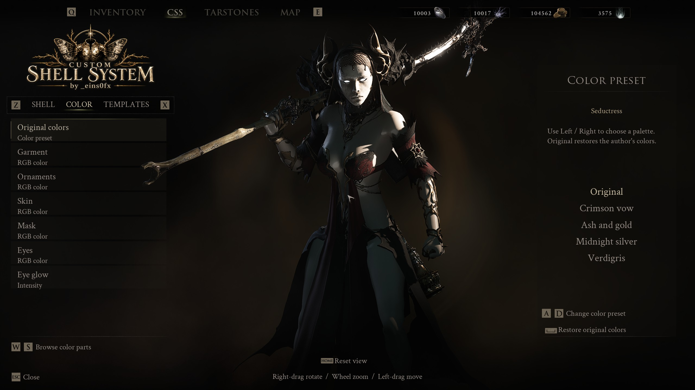
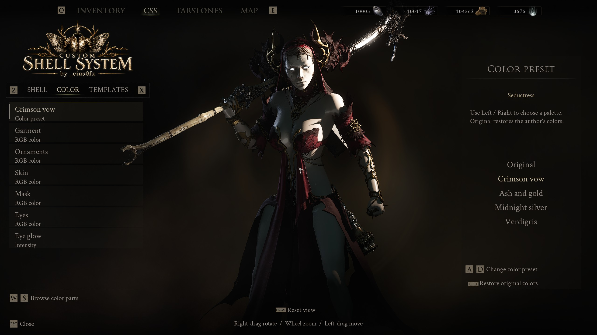
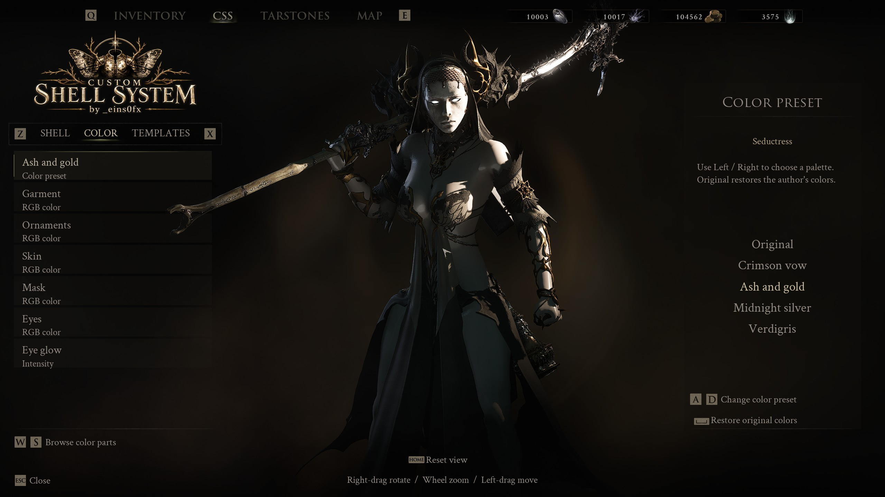
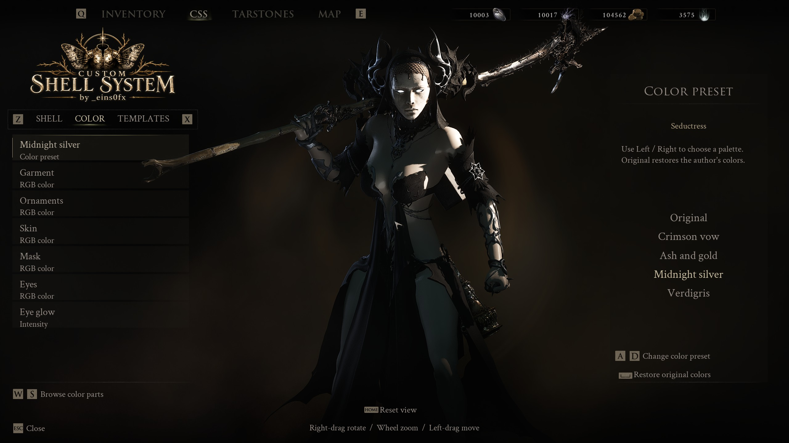
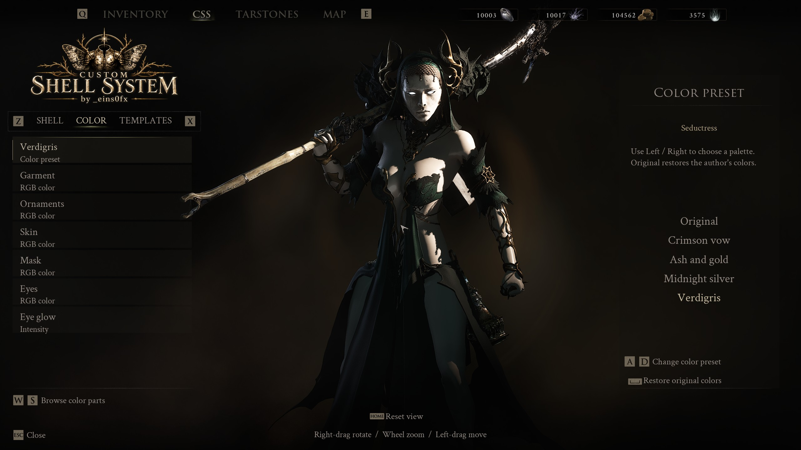
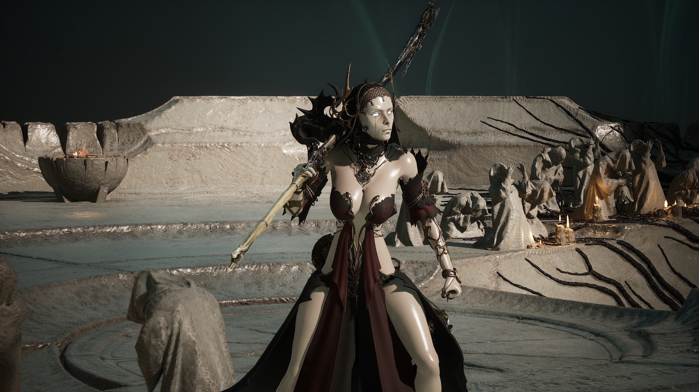
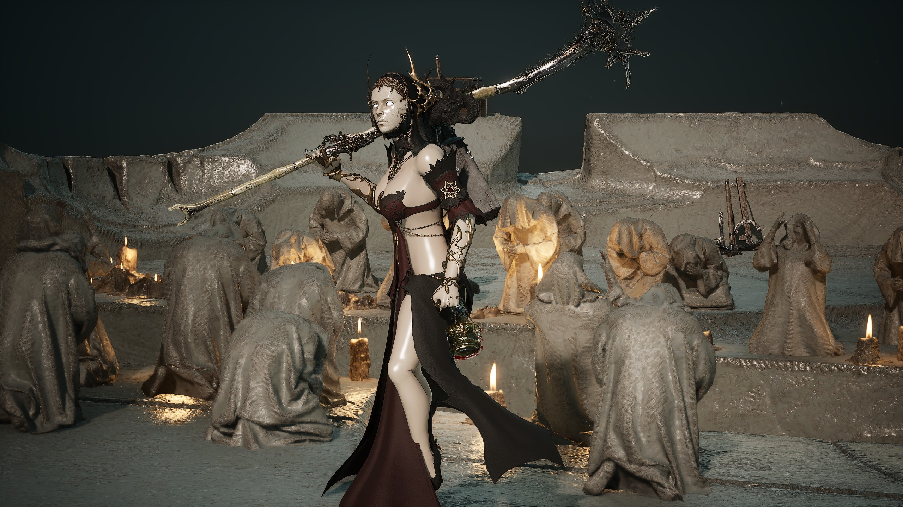

# CSS 0.2.0 gallery

Captured in Mortal Shell II on 14 September 2026. Seductress is the featured outfit.
These screenshots show the native Inventory CSS page, replacing the old N menu.

## Shell, Color and Templates

## Seductress palettes

## In the world

## Videos

- [CSS menu walkthrough, 1080p60](css-menu-demo-1080p60.mp4): Original restoration, all eight installed outfits and nineteen mesh variants, followed by Seductress colors, templates and camera controls.
- [Seductress showcase, 1080p60](seductress-showcase-1080p60.mp4): character-centered camera movement and live palette changes in the game world.

The videos capture the game fullscreen on its display. The originals are
2560×1440 at 60 fps. The published copies use H.264/AAC at 1920×1080 and
60 fps, scaled with Lanczos. Each Git-tracked video stays below 100 MiB.
Original recordings and rejected takes stay in the ignored
`work/media-v0.2.0/` folder, outside the runtime ZIP.

The camera sequence uses development-only CSS commands. Those commands do not
ship in the release DLL. The sequence restores the gameplay camera afterward.
Menu actions use the same appearance and state operations as normal CSS controls.
These are game captures, not generated renders.

The Shell walkthrough also shows separately installed outfits by erase,
dantemk2, calcalmon, XTGMods, ducttus and GetJinxyed. Those assets are not bundled
with the CSS framework. See the package authors' credits and permissions.

See [the local capture workflow](../capture.md) for the development camera and recording setup.
