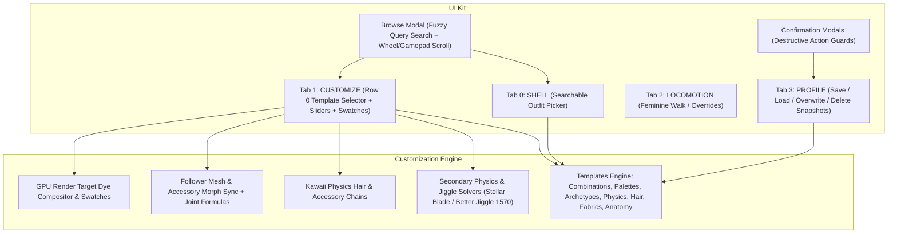

# Next-Gen CSS 2.0 Customization Architecture & UI Kit Specification

This document records the architectural blueprint, UI kit specifications, secondary physics / Kawaii physics engine, and template/profile design for **CSS Next-Gen (v1.0.0-beta / CSS 2.0)**.

---

### 1. Architectural Overview & Implemented Systems

---

### 2. What Has Been Implemented

#### A. Modular UI Kit

* **Searchable ComboBox / Browse Modal (`native_picker_`)**:
  - Live query filtering with caret focus, mouse-wheel scrolling, keyboard (`Up`/`Down`/`Enter`/`Esc`), and gamepad navigation (`D-Pad`/`FaceButton`).
  - Activated via:
    - **`ui_browse_shells`**: Search all catalog outfits and authors in Tab 0 (`SHELL`).
    - **`ui_browse_templates`**: Search all combinations, palettes, archetypes, and physics presets in Tab 1 (`CUSTOMIZE`).
    - **`ui_browse_choice`**: Search choices for multi-texture controls.
* **Confirmation Dialog Modals (`confirm_action_`)**:
  - Darkened backdrop dialog with title, description, and Cancel/Confirm buttons.
  - Guards destructive actions:
    - *"Delete profile"* in `PROFILE` tab.
    - *"Replace with current character"* (overwrite) in `PROFILE` tab.
    - *"Reset all customizations"* in `CUSTOMIZE` tab.
  - Camera orbit and character locomotion controls are suspended during modal interactions.
* **Sliders & Color Swatches**:
  - HSL Tint Sliders (Hue -180..180°, Saturation 0..200%, Brightness 0..200%).
  - Discrete RGB Channel Sliders (0..255).
  - Opacity / Sheerness Sliders (0..100% for lace, chiffon, stockings).
  - Secondary Physics Sliders (Bounce Hz, Settle %, Travel cm).
  - Morph Weight Sliders (0..100% or min..max).
  - Glow Radiance & Pulse Sliders (Intensity cd/m², Pulse Hz).
  - 24-chip deterministic swatch strip.

---

#### B. Terminology: Templates vs. Profiles

* **Templates**: Subsystem combinations and presets curated by mod authors inside `outfits[].templates`:
  - `combinations`: Multi-toggle and item sets (e.g. *"Topless Harness Set"*, *"Battle-Damaged Gown"*).
  - `palettes`: Author color palettes (e.g. *"Crimson Vow"*, *"Void Obsidian"*).
  - `archetypes`: Body morph combinations (e.g. *"Voluptuous"*, *"Petite Seductress"*, *"Athletic"*).
  - `physics`: Jiggle dynamics presets (e.g. *"Firm Athletic"*, *"Sensual Bouncy"*, *"Ultra Soft"*).
  - `hair`: Hair style & ponytail sway presets.
  - `accessories`: Accessory toggles & jewelry sets.
  - `fabrics`: Sheerness & fabric opacity presets.
  - `anatomy`: Intimate morphs, breast shapes, glute curves, and orifice depths.
  - Row 0 of Tab 1 (`CUSTOMIZE`) features the **Template Selector** with quick Left/Right cycling, preset direct-selection, and the *"Browse templates..."* modal.
* **Profiles**: The 4th Tab (renamed from `TEMPLATES` to `PROFILE`):
  - Saves global character snapshots across all tabs (worn shell + variant + custom colors + tints + morph shapes + physics tuning + walk style + toggles).

---

#### C. Secondary Physics & Kawaii Physics Engine

* **Stellar Blade & Better Jiggle Mod (Nexus 1570) Learnings**:
  - **Dynamic Frequency & Damping Integration**: Bounce Hz ($K = (2\pi f)^2$) and Settle % ($D = 4\pi\zeta f$).
  - **Travel Clamping (`max_displacement`)**: Prevents bones from clipping outside the outfit during running/landing/dodging via `MaxDisplacement` and `bLimitDisplacement`.
  - **3-Axis Rotational Swing (`bRotateX/Y/Z`)**: Breasts (`brust`, `breast`), glutes (`butt`, `glute`), and soft tissue swing with pitch, roll, and yaw rotation instead of rigid linear translation.
  - **Planar & Lateral Constraints (`planar_constraint`)**: Prevents unnatural sideways crossover and inner-thigh collision clipping.
* **Kawaii Physics Parameters**:
  - `world_damping` (0..1): Dampens global acceleration impact.
  - `limit_angle` (0..180°): Cone deflection clamp preventing unnatural mesh twisting.
  - `collision_radius` (0..100 cm): Virtual boundary sphere preventing penetration into adjacent anatomy.
  - `gravity_scale` (-5..5): Gravitational pull factor.
* **Expanded Anatomical & Accessory Role Vocabularies**:
  - Breasts (`breast`), Glutes (`butt`), Hips & Thighs (`thigh`), Waist & Belly (`waist`).
  - Genitalia & Orifices (`clitoris`, `labia`, `vestibule`, `orifice`).
  - Hair systems (`hair`, `ponytail`, `bangs`, `braid`, `body-hair`, `pubic`).
  - Head accessories (`headwear`, `crown`, `hairpin`, `tiara`, `veil`).
  - Fabric accessories (`fabric`, `cape`, `cloak`, `scarf`, `skirt`, `sash`, `sheer`, `lace`).
  - Jewelry (`jewelry`, `necklace`, `choker`, `earring`).
